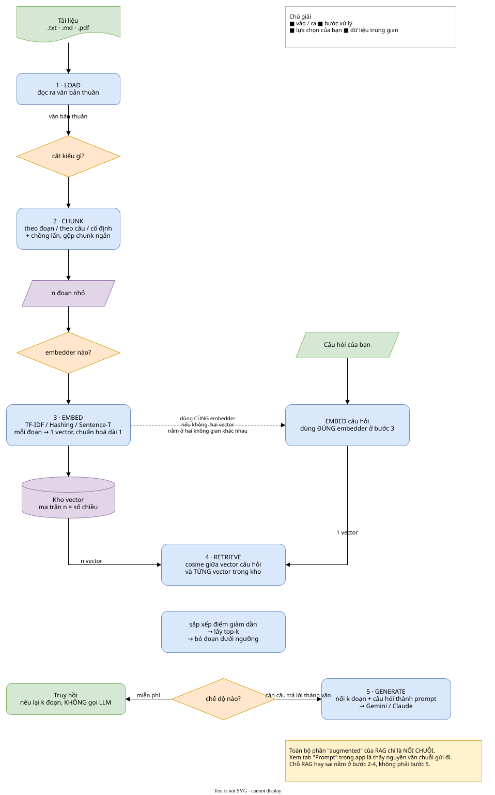
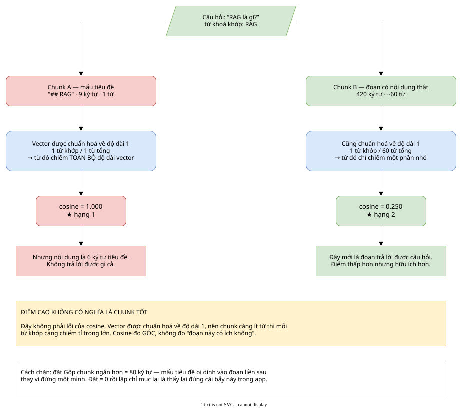
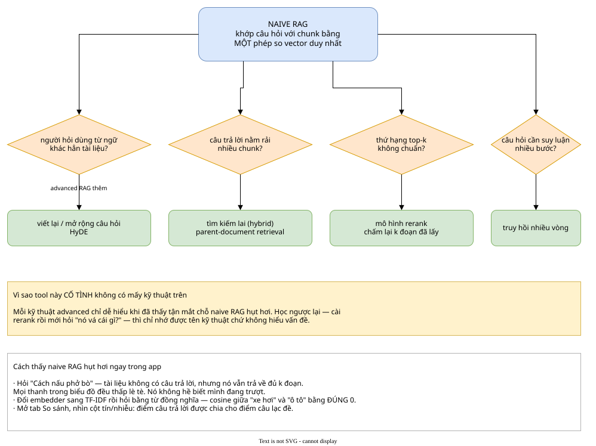

# RAG Lab — chatbot naive RAG 

Tool desktop **Python + CustomTkinter** dựng đúng một pipeline **naive RAG**, và làm cho từng bước của nó nhìn thấy được: chunk nào được chọn, score bao nhiêu, prompt cuối cùng trông ra sao.

Cố tình **không** có: query rewriting, reranking, hybrid search, HyDE, parent-document retrieval, multi-hop retrieval. Đó là advanced RAG. Mục đích ở đây là hiểu thật kỹ pipeline lõi (core pipeline) trước.

## Cài đặt & Chạy

```bash
cd src/day-05-rag-lab
python -m venv .venv
.venv\Scripts\activate             # Linux/macOS: source .venv/bin/activate
python -m pip install -r requirements.txt
python app.py                      # mở GUI, đã nạp sẵn sample documents
python selftest.py                 # self-test suite kiểm tra toàn bộ pipeline, không cần GUI
```

Tuỳ chọn, cài riêng khi cần (xem chi tiết trong `requirements.txt`):

```bash
python -m pip install sentence-transformers   # semantic embedding đa ngôn ngữ
python -m pip install anthropic               # bước GENERATE gọi Claude LLM
python -m pip install pymupdf                 # parser đọc file PDF
```

Chạy được đầy đủ mà **không cần API key và không cần internet** — embedder TF-IDF và chế độ "Retrieve-only" hoạt động hoàn toàn local/offline.


### Chạy offline

Toàn bộ phần quan trọng của tool — chunking, embeddings, retrieval, score chart, vector space map (3D PCA), tab Compare (Benchmark), tab Prompt — **chạy local**. Chế độ mặc định là *Retrieve-only* và không gửi bất kỳ request nào ra ngoài internet.

Chỉ bước 5 (GENERATE) mới cần LLM, và bước này là **tuỳ chọn**. nếu bạn chưa có API key, hãy giữ nguyên chế độ mặc định *Retrieve-only*.

Nếu muốn câu trả lời dạng natural language mà vẫn free, bạn có thể tích hợp LLM local hoặc mô hình khác vào hàm `answer_with_claude()` / `answer_with_gemini()` trong `rag_core.py` — các hàm này nhận `(system, user)` và trả về string text.

### Bước GENERATE — ba lựa chọn

Tuỳ chọn ở mục **5 · GENERATE** (ghim đáy cột trái):

| Chế độ | Yêu cầu | Ghi chú |
|---|---|---|
| **Retrieve-only** (mặc định) | Không cần gì | Trả về retrieved chunks, không gọi LLM |
| **Gemini** | `GEMINI_API_KEY` | Google AI Studio |
| **Claude** | `ANTHROPIC_API_KEY` | Trả phí theo token usage |

Thiết lập API key qua **biến môi trường (environment variables)**, không hardcode vào file:

```bash
setx GEMINI_API_KEY "khoá-của-bạn"      # Windows, mở lại terminal sau khi set
export GEMINI_API_KEY="khoá-của-bạn"    # Linux/macOS
python -m pip install -U google-genai
```

Dòng trạng thái dưới ô nhập key sẽ hiển thị **✓ đã thấy** hoặc **✗ chưa thấy** biến môi trường tương ứng.

Nếu gọi API thất bại (chưa cấu hình key, rate limit, mất mạng), hệ thống sẽ thông báo lỗi và **tự động fallback về chế độ Retrieve-only** thay vì crash ứng dụng.

### Chi tiết bước gọi Claude (tuỳ chọn)

Mặc định sử dụng **`claude-opus-5`** với `max_tokens=4096`. Trần token này giới hạn **tổng** của reasoning tokens và output tokens — Claude Opus bật reasoning mặc định, nên nếu đặt `max_tokens` quá thấp thì output sẽ bị ngắt quãng giữa chừng.

## Pipeline Flowchart



Điểm cốt lõi cần lưu ý: **query bắt buộc phải được encode bằng đúng embedding model đã dùng ở bước index**. Nếu dùng 2 embedders khác nhau, 2 vectors sẽ thuộc về 2 vector spaces khác nhau và phép tính cosine similarity sẽ hoàn toàn vô nghĩa.

<details>
<summary><b>Bẫy “orphan heading”</b> — vì sao chunk 9 ký tự lại đạt score 1.000</summary>



</details>

<details>
<summary><b>Naive RAG fail ở đâu</b> — và advanced RAG giải quyết thế nào</summary>



</details>

## 5 bước trong Naive RAG Pipeline

```
1. LOAD      documents → raw text
2. CHUNK     raw text  → chunks
3. EMBED     chunks    → embeddings
4. RETRIEVE  query     → embeddings → top-k chunks (cosine similarity)
5. GENERATE  chunks    → prompt template → LLM generation
```

Sơ đồ pipeline trên đầu cửa sổ sẽ highlight realtime theo bước đang thực thi.

## Phân tích Score Chart

- Thanh xanh (picked) = nằm trong top-k và vượt threshold, thanh xám (dropped) = bị loại, đường đứt nét đỏ = score threshold.
- **Score drop dốc mạnh** sau rank 1 → retrieval tự tin, kết quả vượt trội.
- **Score thoai thoải** → chunk rank k không khác biệt nhiều so với chunk rank k+1, retrieval đang bị ambiguous. Chỉ số *margin rank 1–2* dưới khung chat phản ánh rõ hiện tượng này.
- **Mọi cột score đều thấp** → documents nhiều khả năng không chứa thông tin trả lời.

## Các Embedding Models

| Model | Nguyên lý hoạt động | Trade-offs |
|---|---|---|
| **TF-IDF** | Vector thưa (sparse vector), giá trị = term frequency × inverse document frequency | Local, không cần internet, minh bạch (xem được top contributing terms). Chỉ match **exact keyword**. |
| **Hashing** | Hash tokens vào fixed dimensions (hashing trick) | Không cần fit vocabulary. Chấp nhận hash collisions. Dùng làm baseline benchmark. |
| **Sentence-Transformers** | Dense vector từ pre-trained Transformer encoder | Hiểu semantic meaning và synonyms (từ đồng nghĩa). Cần download model ở lần đầu. |

## Vector Space Map (3D PCA)

Chiếu embeddings từ không gian nhiều chiều xuống 3D bằng kỹ thuật PCA. Biểu tượng ngôi sao vàng là query vector, các chấm xanh là retrieved chunks.

*Lưu ý:* PCA giảm chiều dữ liệu và làm mất mát một phần variance. Vì vậy, khoảng cách thị giác trên biểu đồ 3D chỉ mang tính trực quan hóa hình học; căn cứ chính xác nhất luôn là cosine score trên Score Chart.

## Sử dụng Pipeline qua Code (Headless)

`rag_core.py` hoàn toàn độc lập với Tkinter:

```python
import rag_core as R

p = R.Pipeline(chunk_strategy="By Paragraph", chunk_size=500,
               min_chunk_chars=80, top_k=4)
p.index([("sample.txt", open("sample.txt", encoding="utf-8").read())])

r = p.ask("câu hỏi của bạn")
for h in r.hits:
    print(f"[{h.rank}] score: {h.score:.3f} | {h.chunk.preview()}")

system, user = R.build_prompt("câu hỏi của bạn", r.hits)
```

## Khuyến nghị chọn Hyperparameters

- **Chunk size quá nhỏ** → thiếu context, LLM không đủ thông tin để trả lời.
- **Chunk size quá lớn** → embeddings bị loãng thông tin, cosine score kém phân biệt.
- **300–800 ký tự** là điểm bắt đầu cân bằng cho đa số văn bản.
- **Chunk overlap** giúp tránh việc ngữ cảnh bị đứt đoạn giữa 2 chunks liền kề.
- **Top-k lớn** cung cấp nhiều context hơn nhưng làm tăng prompt tokens và có thể đưa thêm nhiễu (distractors).